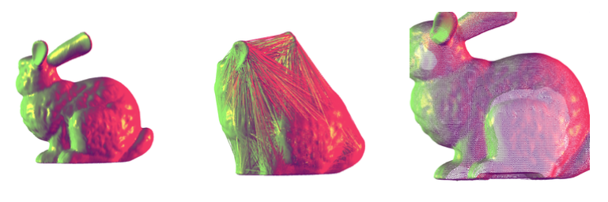
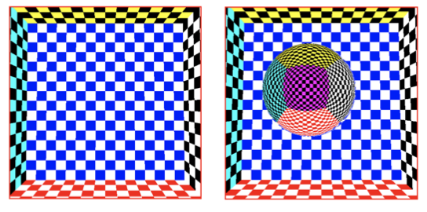
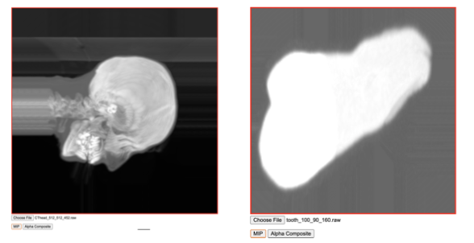
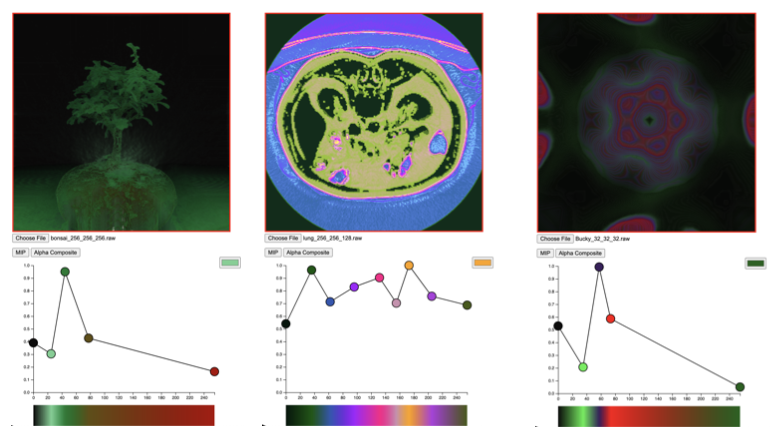

# webGL Graphics
This repository contains code for graphical rendering using webGL and Javascript. Basic concepts such as Phong lighting, and cube mapping are shown. The <b>alpha_blending</b> demonstrates more advanced rendering techniques such as maximum intensity projection, and alpha blending. The examples shown here are based on some of the assignments I had to complete for my Interactive and Visualization course (COSE436) at Korea University.

## Basic Graphics Rendering
In order to load the OFF file, I created 5 different arrays (vertices (points), indices, face normals and vertex normals) and an adjacency list dictionary. As you may have suspected, there is actually an additional array called “temp_indicies” that I created to aid the calculation of the vertex normals.

The adjacency dictionary is used for the calculation of vertex normals. In order to do so, I first had to calculate the face normals. This is important as all the faces that touch a given vertex must be considered when calculating its normal. Therefore, by first calculating the normals of the faces, I was able to average those values to find the normals corresponding to each vertex. To avoid repetition, I created a new function called “calc_normal” that calculates the normal given two vertices. Lines 219 to 235 indicate said process.

Once the vertices, vertex normals and vertex indices are collected from the OFF file, I loaded the three arrays into their respective buffers. Vertex normals have the “v_normal_input” attribute, while the vertices have the “vPosition” attribute. It is important to note that the indices array actually contains two times more values than what is provided in the OFF file. The reason for this is to accommodate the lines rendering method which is required for wireframe rendering.

### Vertex Transformation
The vertex shader is responsible for transforming the object's vertex to the screen space. The required transformations are stored in uniforms so that they can be accessed by the vertex shader. Since there is only one object in the rendering scene, we dont have to worry about any world transformations. We can treat the object space as the world space. However, we do have to define the camera-view transformation matrix. This matrix represents where we are viewing the loaded object. This is easily calculated using the “lookAt” function provided in the utils Javascript file (MV.js). By initializing the EYE, AT and UP vectors, we can define a new space that we call the view space. In our vertex shader, vertices are transformed to the view space, before being projected onto the screen space. The part of the code that achieves this can be found in the vertex shader. I do note that we can scale and rotate our objects in object space if one chooses to do so. However, for this assignment I simply left the model matrix as the identity matrix.

### Orthogonal and Perspective Projection
The purpose of projection is to transform points defined in 3D space to screen space (2D). There are many different methods of projection, but the two methods defined in this project are the orthogonal and perspective projection. Thankfully, the skeleton code contained a utilities file that has predefined functions for calculating the orthogonal and perspective projection matrices. Since the projection matrix is independent of the model loaded onto the HTML canvas, I set the perspective projection matrix with a fovy of 15, aspect of 1 and -0.5, +0.5 for the near and far planes respectively. The aspect ratio is determined by the size of the canvas, which I modified to have a width of 800px and a height of 800px. For orthogonal projection, I set the left, right, bottom, top to have values ranging from -0.5 to 0.5, while the near and far values were set to 0.5 and 1000 respectively. I should note that the parameters for projection can be changed, if certain objects are not rendered properly. I noticed that although the bunny and dragon files loaded well with the given projection parameter, the fandisk file appeared too large. However, this is not such an issue as users can zoom out of the view if objects appear too large. The figure on the left is an example of perspective transformation, whilst the figure on the right is an example of orthogonal transformation. The example image below highlights the final product of rendering the <b>bunny.off</b> file provided in this repository.

## Environment Mapping
The same process is used to load the OFF file, and calculate the required vertex information. Environment mapping is completed using the cube map texture function available in webGL. The cube vertices are placed in an array called “cube_vertex”. This vertex array is used to set the environment map. To confirm the enviornment map was successfully applied, I rendered a sphere that is textured by the reflection of the environment. To achieve this, I had to pass the sphere's vertex normal data to the GPU buffer. Then, in the fragment shadder, the reflected vector (from the vertex normal) was used to collect the RGB color to apply to the sphere vertex. The left image is the environment map applied to the cube, and the image on the right shows the rendered sphere.

## MIP & Alpha Blending
MIP (maximum intensity projection) does not require a transfer function. However, since for alpha blending a transfer function is required, I will first explain how I implemented the transfer function.

For the transfer function, I had to create a UInt8Array to transfer the data from the interface.js file. This array is denoted as transfer_data in my code. The length of this array is 256*4 (since there are four color channels - R,G,B,A). Using the same technique as above, I created a 3D texture, where the height and depth of the texture is set to 1 (I did this because sampler 1D is not supported in WebGL 2.0). The code for creating the transfer function texture can be found in the <i>set_transfer_texture()</i> function.

### Maximum Intensity Projection
Using only the voxel data texture, I found the maximum intensity by running a for loop. I realized very quickly that there was no need to find the actual entry and end point in order to calculate the maximum intensity. For every ray casted, the ray travels for 10000 iterations and updates the maximum invesity value accordingly. The ray starting point is determined by the position of the pixel fragment, and the ray direction is a unit vector determined by the eye position (denoted as viewdir in my code) and the ray starting point. The color is then determined entirely by the maximum intensity found. This process is repeated for all pixels in the fragment shader.

### Alpha Blending
There are two components that needs to be interpolated: color (RGB) and alpha (a). You can use whichever interpolation method you liked, but for my implementation, I decided to use linear interpolation. If the interpolated alpha value is greater than 0.98, then my code terminates and returns the current color. This is because, if the current alpha is 0.98 or greater, then the contents that will appear later on will not have much effect on the final color. While it is okay to continue, it is a waste of computing resources.

